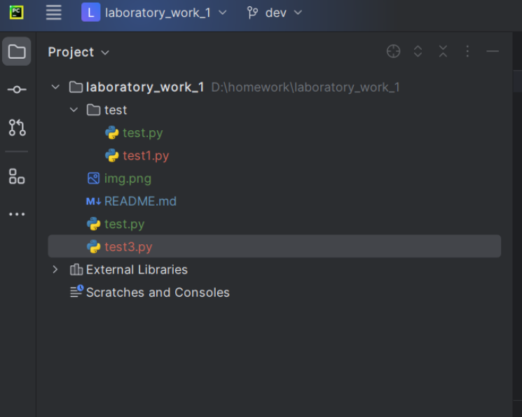
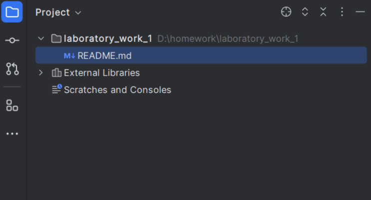

## Полная очистка репозитория от изменений
___
Ссылка на документацию https://book.git-scm.com/docs/git-clean <br>
Ссылка на документацию https://book.git-scm.com/docs/git-reset <br>

Выполните последовательно команды ```git clean -f``` и ```git reset --hard``` <br>

Пример использования команды: <br>
- Состояние репозитория до

- Состояние репозитория после


## Перенос коммита из одной ветки в другую с проставлением тега
___
Ссылка на документацию https://git-scm.com/docs/git-tag <br>
Ссылка на документацию https://git-scm.com/docs/git-tag <br>

Выполните последовательно команды:
1. Переходим в ветку куда будем заливать изменения ```git checkout <имя ветки>``` - в нашем случае ```prd```
2. Мержим изменения из интересующей ветки```git merge <имя ветки>``` - в нашем случае ```dev```
3. Ставим тег на новый коммит ```git tag -a <имя тега> -m "<ваше сообщение>"``` <br>
